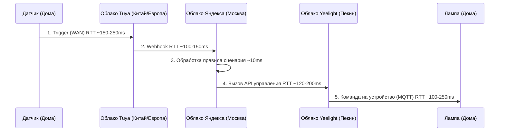

Одна из самых частых и раздражающих жалоб пользователей умного дома — «задержка включения света по датчику движения». Представь: человек заходит в темный коридор, делает два шага в темноте, и только через 2–3 секунды загорается лампа. Это полностью убивает комфорт автоматизации. 

Давай разберем «бюджет задержки» (latency budget), поймем, из каких физических этапов складывается этот лаг, и как настроить систему так, чтобы время реакции упало до незаметных глазу $30-50\text{ мс}$.

---

## Физика задержки Wi-Fi датчиков против Zigbee

В 99% случаев виновниками задержек выступают беспроводные датчики, работающие по протоколу Wi-Fi. Чтобы понять почему, давай сравним их жизненный цикл при обнаружении движения с датчиками Zigbee.

### Как просыпается Wi-Fi датчик (бюджет задержки: $1.5 - 3.5\text{ сек}$):
Поскольку Wi-Fi — чрезвычайно энергозатратный протокол, датчик на батарейках вынужден спать глубоким сном (Deep Sleep) с отключенным радиомодулем. При фиксации движения аппаратно запускается следующий цикл:
1. **Пробуждение MCU**: $50-100\text{ мс}$.
2. **Сканирование эфира и ассоциация с точкой доступа (Wi-Fi Association)**: $800-1500\text{ мс}$ (включая хендшейк WPA2/WPA3).
3. **Получение IP-адреса по DHCP**: $500-1000\text{ мс}$ (запрос DHCP Discover, выбор адреса роутером).
4. **Установка TCP-соединения и TLS-хендшейк с облачным сервером**: $300-600\text{ мс}$.
5. **Передача полезного пакета данных**: $50\text{ мс}$.
6. **Переход в режим сна**: $20\text{ мс}$.

Суммарно проходит не менее **$1.5-3$ секунд**, прежде чем Яндекс Станция вообще узнает, что в коридоре кто-то есть.

### Как работает Zigbee датчик (бюджет задержки: $20-50\text{ мс}$):
Протокол Zigbee (IEEE 802.15.4) разработан специально для датчиков со сверхмалым потреблением. Датчик не разрывает соединение со своим «родителем» (роутером или координатором). Он находится в состоянии сна, но его таблица ассоциации активна.
1. При срабатывании радиомодуль мгновенно отправляет пакет данных без предварительного согласования IP и сканирования частот.
2. Процедура CSMA/CA (оценка занятости канала) занимает $2-5\text{ мс}$.
3. Передача кадра на физическом уровне (MAC-уровень) длится около $10\text{ мс}$.
4. Если сеть настроена правильно и нет радиопомех от Wi-Fi (подробнее о разнесении частот читай в статье о [таблице каналов Zigbee и Wi-Fi](/troubleshooting/zigbee-channel-mapping)), координатор получает сигнал мгновенно.

---

## Пинг облаков: Путь пакета в Cloud-to-Cloud сценариях

Если в сценарии используются устройства разных экосистем, подключенные через привязку аккаунтов (например, датчик Tuya, а лампа Yeelight), то сигнал совершает «кругосветное путешествие»:

Суммарный сетевой пинг (без учета внутренних очередей на серверах) легко превышает **$1-2\text{ секунды}$**. В периоды пиковых вечерних нагрузок облачные серверы могут задерживать обработку вебхуков до $5-10$ секунд или вовсе терять запросы.

---

## Как перевести сценарии на локальное выполнение

Для устранения сетевых задержек Яндекс разработал локальный движок сценариев. Когда сценарий выполняется локально, Яндекс Станция или Яндекс Хаб обрабатывают его на собственном процессоре, передавая команды Zigbee-устройствам напрямую на радиомодуль, минуя интернет.

### Требования для локального выполнения (иконка «Молнии» в приложении):
1. **Все устройства в сценарии должны быть Zigbee** (и триггеры, и исполнители).
2. **Все устройства должны быть подключены к одному хабу Яндекса** (напрямую, без сторонних шлюзов Aqara/Tuya).
3. **В сценарии не должно быть облачных действий**:
   * Голосовых ответов Алисы («Свет включен»).
   * Запуска музыки, радио или шумов на Станции.
   * Отправки push-уведомлений на телефоны.
   * Проверки условий, завязанных на внешнюю погоду или время заката/рассвета (если они требуют обращения к API погоды).
   * Использования Wi-Fi реле, Wi-Fi лампочек или устройств, добавленных через сторонние навыки (Xiaomi, Tuya, Smart Life).

Как только ты уберешь эти элементы, сценарий автоматически синхронизируется с хабом для локальной работы. Ознакомься с подробным гайдом по [настройке локальных сценариев Яндекса](/scenarios/local-scenarios-setup).

---

## Сетевая оптимизация Wi-Fi роутера для исполнительных устройств

Если тебе все же приходится использовать Wi-Fi лампы или реле в качестве исполнителей (так как они дешевле и не требуют хаба), оптимизируй настройки роутера для снижения времени их отклика:

1. **Настройка DTIM (Delivery Traffic Indication Message)**: 
   В настройках Wi-Fi роутера на частоте $2.4\text{ ГГц}$ найди параметр `DTIM Interval`. По умолчанию он может быть равен 3 или 10 (это позволяет Wi-Fi клиентам спать дольше). Установи значение **`1`** или **`2`**. Это заставит роутер чаще будить Wi-Fi реле для передачи данных, снизив задержку приема команды.
2. **Снижение Beacon Interval**:
   Установи `Beacon Interval` в значение **`100 мс`** для стабильного поддержания сессии.
3. **Статический IP (DHCP Reservation)**:
   Привяжи IP-адреса Wi-Fi ламп и реле к их MAC-адресам на роутере. Это исключит фазу повторного согласования IP при кратковременных дисконнектах.
4. **Разделение сетей**:
   Создай отдельный IoT SSID на частоте $2.4\text{ ГГц}$ с шириной канала $20\text{ МГц}$, чтобы уменьшить коллизии с медиа-устройствами (смартфоны, ТВ-приставки), работающими на $40\text{ МГц}$. Подробнее о борьбе с сетевыми задержками роутера читай в инструкции по [устранению дисконнектов Яндекс Станции](/troubleshooting/yandex-station-wifi-drop).

---

## Влияние топологии Zigbee-сети на пинг

В больших квартирах и загородных домах сигнал идет через ретрансляторы (Zigbee-роутеры — устройства с постоянным питанием от сети). Каждый «хоп» (транзитный узел) добавляет к задержке от $10$ до $30\text{ мс}$.

* **Минимизируй вложенность сети**: Старайся располагать важные датчики движения так, чтобы они связывались с координатором напрямую или через максимум один роутер.
* **Следи за LQI (Link Quality Indicator)**: Если уровень связи LQI между датчиком и ближайшим роутером падает ниже 50, начинаются потери пакетов на физическом уровне. Датчик будет пытаться переотправить пакет (до 3 раз по спецификации MAC IEEE 802.15.4), что увеличивает задержку с $30\text{ мс}$ до $1.5-2\text{ сек}$, а в случае полной потери линка запустит долгий процесс Route Discovery (поиск нового маршрута), блокирующий отправку команд. Подробно о решении этой проблемы читай в статье про [борьбу с отвалами датчиков Aqara](/troubleshooting/aqara-troubleshooting) и [ошибки «Устройство не отвечает»](/troubleshooting/device-not-responding).
